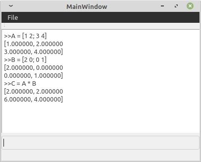

A Matrix Calculator
Depends on QT development libraries and qt creator for the build probably.

The lines prefixed with '>>' are the user input lines, the lines beneath them show the response from the program.

TODO
Make exceptions sensible
make errors more clear
double parsing
fix operators for variables (currently fucked A * B modifies A oops)
scripting but thats a big maybe
functions
